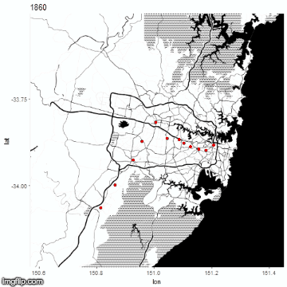

# sydney_train_stations
Demonstrating the expansion of Sydney's rail network

An R script that progressively demonstrates how the rail network of Sydney was built, from 1860 to today. (Doesn't include the new Metro lines)
